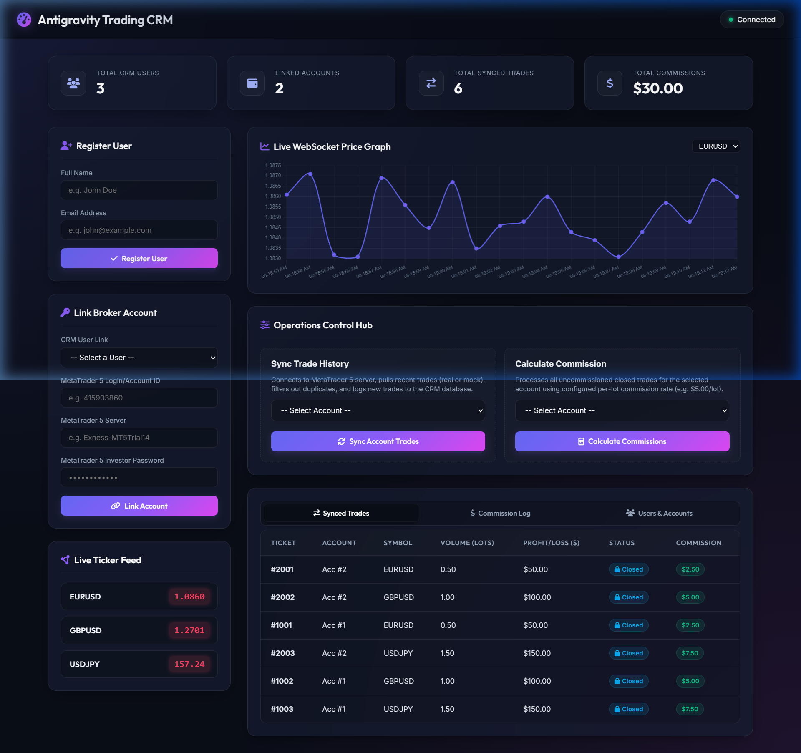

# Trading CRM with Real-time Premium Dashboard

A comprehensive Trading CRM built with **Flask, SQLAlchemy, SQLite, Flask-SocketIO, and a (mock) **MetaTrader 5** integration.

This project features a **premium glassmorphic dark-mode dashboard** that visualizes metrics in real-time, displays live charts, and demonstrates all background operations (trade syncing, commission calculation) and WebSocket feeds.

---

### Dashboard Preview

<p align="center">
  
</p>

---

## Features / Phases

| Phase / Feature | Details |
|---|---|
| **Real-time Premium Dashboard** | Real-time tickers, live Chart.js price feeds, Operation Hub controls, and toast notifications. |
| **User Management** | Register users, list active users, and delete users (with full database cascade deletes). |
| **Broker Account Management** | Link broker accounts (MetaTrader 5 servers/credentials), list linked accounts, and delete broker accounts. |
| **MT5 Integration** | Supports Mock MT5 (deterministic test trades) and Real MT5 (requires Windows and active terminal). |
| **Trade Synchronization** | Syncs trades for any registered broker account, featuring ticket duplicate prevention. |
| **Commission Engine** | Calculates commissions on closed trades (`$5 per lot` / volume), saves log records, and emits notifications. |
| **WebSockets (Socket.IO)** | Multi-channel market data feeds (`market_data` rooms) and real-time calculation notifications (`commission_created`). |


---

## Setup

### 1. Create the database

```sql
CREATE DATABASE trading_crm;
```

### 2. Install dependencies

```bash
cd trading-crm
python -m venv venv
source venv/bin/activate        # Windows: venv\Scripts\activate
pip install -r requirements.txt
```

### 3. Configure

Copy `.env.example` to `.env` and adjust the MySQL credentials, **or** export them:

```bash
export DB_USER=root
export DB_PASSWORD=yourpassword
export DB_HOST=127.0.0.1
export DB_NAME=trading_crm
```

> Tables are created automatically on startup via `db.create_all()`.

### 4. Run

```bash
python app.py
```

Server starts on `http://localhost:5000` with:
- **Interactive UI**: Navigate to `http://localhost:5000/` to access the Dashboard
- **REST APIs**: Available on the same host
- **Socket.IO**: Real-time market feed and notifications
- **Periodic Background Worker**: Automatically runs every 60 seconds

---

## API Documentation

### Users

* **Create user** — `POST /users`
  ```json
  { "name": "Vaibhav", "email": "vaibhav@gmail.com" }
  ```
  Response: `{ "message": "User created", "id": 1 }`

* **List users** — `GET /users`
  Response: `[ { "id": 1, "name": "Vaibhav", "email": "vaibhav@gmail.com", "created_at": "..." } ]`

* **Delete user (with cascade)** — `DELETE /users/<user_id>`
  Deletes the user and automatically purges all linked broker accounts, trades, and commissions.
  Response: `{ "message": "User 1 deleted successfully" }`

### Broker Accounts

* **Add broker account** — `POST /broker-accounts`
  ```json
  { "user_id": 1, "account_number": "123456", "server": "MetaQuotes-Demo", "password": "secret" }
  ```
  Response: `{ "message": "Broker account added", "id": 1 }`

* **List broker accounts** — `GET /broker-accounts`
  Response: `[ { "id": 1, "user_id": 1, "account_number": "123456", "server": "MetaQuotes-Demo", "created_at": "..." } ]`

* **Delete broker account (with cascade)** — `DELETE /broker-accounts/<account_id>`
  Deletes the broker account and automatically purges its associated trades and commissions.
  Response: `{ "message": "Broker account 1 deleted successfully" }`

### Trades

* **Sync trades** — `POST /sync-trades/<account_id>`
  Connects to MT5, fetches trade history, stores new trades (skips duplicate tickets).
  Response: `{ "synced_trades": 3 }`

* **List trades** — `GET /trades`
  Returns all synced trades, including their computed commission amounts.
  Response: `[ { "id": 1, "ticket": "1001", "account_id": 1, "symbol": "EURUSD", "volume": 0.5, "profit": 50.0, "commission_amount": 2.5, ... } ]`

### Commissions

* **Calculate commission** — `POST /calculate-commission/<account_id>`
  Generates `$5 × volume` per trade, saves it, and emits a `commission_created` socket event.
  Response: `{ "commissions_created": 3 }`

* **List commissions** — `GET /commissions`
  Returns all computed commissions along with referenced trade details.
  Response: `[ { "id": 1, "trade_id": 1, "commission_amount": 2.5, "ticket": "1001", "symbol": "EURUSD", "volume": 0.5, ... } ]`

---

## WebSocket Events

Connect a Socket.IO client to `http://localhost:5000`.

| Event | Direction | Payload |
|-------|-----------|---------|
| `subscribe` | client → server | `{ "symbols": ["EURUSD"] }` |
| `market_data` | server → client | `{ "symbol": "EURUSD", "price": 1.0853 }` (every second, per subscribed symbol) |
| `commission_created` | server → client | `{ "trade_id": 1, "commission": 5 }` |

Quick test client (Python):
```python
import socketio
sio = socketio.Client()
sio.on("market_data", print)
sio.on("commission_created", print)
sio.connect("http://localhost:5000")
sio.emit("subscribe", {"symbols": ["EURUSD"]})
sio.wait()
```

---

## Database Schema

**users** — `id BIGINT PK, name VARCHAR(100), email VARCHAR(255), created_at DATETIME`

**broker_accounts** — `id BIGINT PK, user_id BIGINT FK, account_number VARCHAR(50), server VARCHAR(100), password VARCHAR(255), created_at DATETIME`

**trades** — `id BIGINT PK, ticket VARCHAR(100) UNIQUE, account_id BIGINT FK, symbol VARCHAR(20), volume FLOAT, profit FLOAT, open_time DATETIME, close_time DATETIME, created_at DATETIME`

**commissions** — `id BIGINT PK, trade_id BIGINT FK UNIQUE, commission_amount FLOAT, created_at DATETIME`

---

## Testing Flow

```bash
# 1. Create user
curl -X POST localhost:5000/users -H 'Content-Type: application/json' \
  -d '{"name":"Vaibhav","email":"vaibhav@gmail.com"}'

# 2. Add broker account
curl -X POST localhost:5000/broker-accounts -H 'Content-Type: application/json' \
  -d '{"user_id":1,"account_number":"123456","server":"MetaQuotes-Demo","password":"secret"}'

# 3. Sync trades  -> {"synced_trades": 3}
curl -X POST localhost:5000/sync-trades/1

# 4. (re-run step 3 -> {"synced_trades": 0}  duplicates skipped)

# 5. Calculate commission -> {"commissions_created": 3}
curl -X POST localhost:5000/calculate-commission/1

# 6. commission_created events arrive over the WebSocket

# 7. Delete broker account -> Purges account, associated trades, and commissions
curl -X DELETE localhost:5000/broker-accounts/1

# 8. Delete user -> Purges user, linked broker accounts, trades, and commissions
curl -X DELETE localhost:5000/users/1
```

---

## Assumptions

- **MT5 runs in Mock mode by default** (`MT5_MODE=mock`) so the project works on
  any OS without MT5 credentials. The mock returns deterministic trades keyed by
  account id, which makes the duplicate-prevention behavior easy to observe
  (first sync inserts trades, subsequent syncs insert 0). Real MT5
  (`MT5_MODE=real`) requires Windows and the `MetaTrader5` package.
- **Commission = `volume × $5`**, one commission per trade (enforced by a unique
  `trade_id`), so re-running the calculation never double-charges.
- **Socket.IO uses `threading` async mode** — no eventlet/gevent needed, and it
  coexists with the APScheduler background thread.
- The background worker iterates every broker account each minute, syncing trades
  then calculating commissions; per-account errors are logged and skipped so one
  bad account never stops the cycle.
- Per the assignment's "minimum submission" guidance, Redis, JWT auth, Docker,
  unit tests, and role management are intentionally out of scope.
